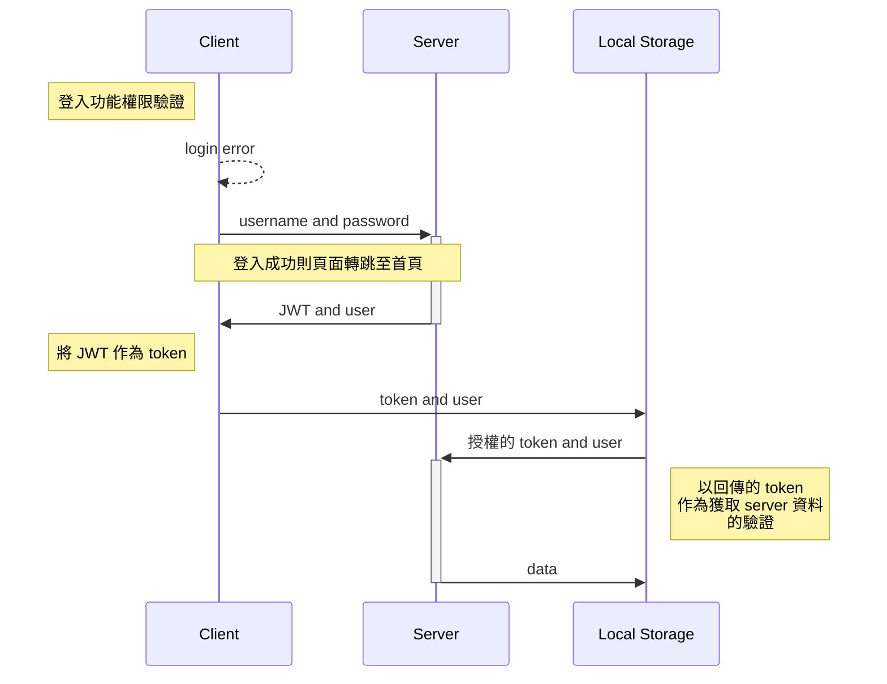
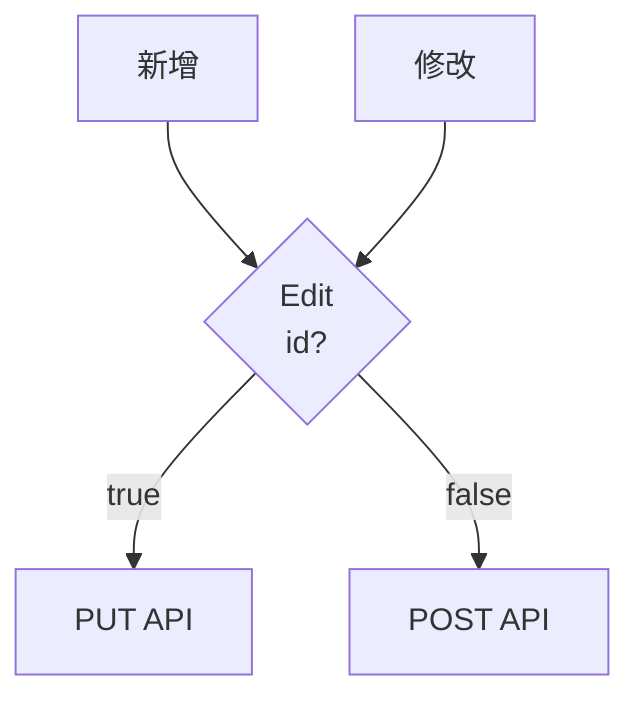

# 蛋糕店購物網站後台

 >本專案為蛋糕店購物網站的管理後台，包含登入頁面、商品管理頁面、編輯頁面及訂單管理頁面，可提供管理者進行商品的管理，包含新增及修改商品的資訊，以及上下架和刪除的功能，同時紀錄所有客戶的歷史訂單。

## 我是管理員
- [後台網址](http://52.192.103.131:8000/)(此帳號僅有讀取功能無修改新增功能)
  - **username:** test
  - **password:** test123
  
## 目錄
- [蛋糕店購物網站後台](#蛋糕店購物網站後台)
  - [我是管理員](#我是管理員)
  - [目錄](#目錄)
  - [工具](#工具)
  - [專案特點](#專案特點)
    - [登入頁面](#登入頁面)
    - [編輯頁面](#編輯頁面)
  - [Demo](#demo)
  - [作者](#作者)

## 工具
- React 18
- React Router v6 
- RTK Query
- Antd
  
## 專案特點
- 登入頁面：登入成功後接收 server 回傳的 JWT 存放於 local storage 中作為權限驗證。
- 商品管理頁面：
  - 商品管理：依據請求方式不同，進行商品的刪除或上下架。
  - 分頁製作：
    - 依 Antd 的分頁功能取得當前頁面，並使用 redux-toolkit 的方式製作分頁
    - 以 useLocation 取得當前頁數，將當前頁數設置於 Antd pagination 的 current 屬性中，當網址頁數更改或上下頁轉換，頁碼也會隨之更改，以達雙向綁定的效果。
- 編輯頁面：使用 useParams 取得當前網頁 id ，並以是否有 id 判斷為新增或修改頁面。
- 訂單頁面：可簡潔紀錄訂單資訊及訂單明細。

### 登入頁面

### 編輯頁面

## Demo
- 商品管理頁面：若商品下架會以紅底提示，欲刪除商品會跳出提示框再次確認

- 修改畫面：當網址有 id 時會自動取得原有的商品資訊，保存時打 PUT API 進行更新 

- 新增畫面：當網址無 id 時則顯示空白欄位，保存時打 POST API 進行新增

- 訂單畫面：列出所有訂單列表，以折疊式列表呈現訂單明細

## 作者
藍奕欣
[Github](https://github.com/ysl0628) 
Email: yihsinlan@gmail.com